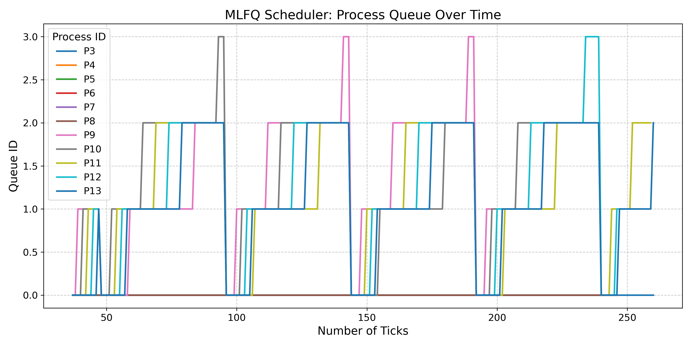
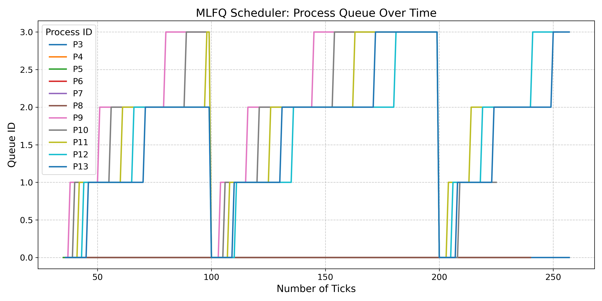

[](https://classroom.github.com/a/JsZCPDRN)
# Intro to Xv6
OSN Monsoon 2024 mini project 2

# xv6
# System Calls
## 1. Gotta count ‘em all
- Added a system call `syscount` and accompanying user program `syscount.c`
- SYNTAX : `syscount <mask> command [args]`
- Changes Made:
    - Added a field `mask` to struct proc which represents the mask of the syscount syscall in `kernel/proc.h`.
    - Added a field `syscall_counts[32]` to struct proc which represents the number of times a syscount was called for process in `kernel/proc.h`.
    - In `kernel/proc.c`, under `allocproc`
        ```
        p->mask = 0;
        for (int i = 0; i < 32; i++) {
            p->syscall_counts[i] = 0;
        }
        ```
    - In `kernel/proc.c`, the mask of child is set to 0 in `fork`.
        ```
        np->mask = 0;
        ```
    - In `kernel/proc.c`, the function `char* syscall_name(int mask)` was introduced to map syscall mask to syscall name.
    - In `kernel/proc.c`, under `exit` function, the logic for handling below requirements were handled.
        - As child exits, it should add all the syscount_counts of itself to its parent.
        - As process whose mask was set exits, it prints the required `syscall_count[i]` based on mask for process pid.
    - In `kernel/syscall.c`, added
        ```
        extern uint64 sys_settickets(void);

        static uint64 (*syscalls[])(void) = {
        ...
        [SYS_getsyscount] sys_getsyscount,
        ...
        }
        ```
        and also implemented logic for incrementing syscall_counts for current process by 
        ```
        p->syscall_counts[num]++
        ```
    - In `kernel/syscall.h`, added
        ```
        #define SYS_getsyscount  23
        ```
    - In `kernel/sysproc.c`, added `uint64 sys_getsyscount(void)` function.
    - In `user/user.h`, added `int getsyscount(int)`.
    - In `user/usys.pl`, added `entry("getsyscount")`.
    - Added `user/syscount.c` that upon the syscall `syscount` being called, checks for correct number of arguements and mask number and executes the command to be executed along with its arguements.
    - Added `$U/_syscount\` under `UPROGS=\` in `Makefile`.
- Logic
    - For all processes, the syscall_count array is updated whenever a syscall is called by the process.
    - When the syscall `syscount` is called, it executes the command and sets the `mask` of the command process to the provided mask. Upon exit, the command process prints the required output.
    - The parent being responsible for its child's syscalls is also handles when child exits, it passes its syscall counts to the parent.
## 2. Wake me up when my timer ends
- Added syscalls `sigalarm` and `sigreturn`.
- `sigalarm(interval, handler)` after every n  ”ticks” of CPU time that the program consumes, the kernel will cause application function fn  to be called.
- `sigreturn()` resets the process state to before the `handler` was called.
- Changes Made:
     - Added fields `alarmticks`, `tickcount`, `alarmhandler`, `in_handler` and `backup_tf` to struct proc in `kernel/proc.h`.
     - All fields were initialised to 0 in `allocproc` in `kernel/proc.c`.
     - In `kernel/syscall.c`, added
        ```
        extern uint64 sys_sigalarm(void);
        extern uint64 sys_sigreturn(void);

        static uint64 (*syscalls[])(void) = {
        ...
        [SYS_sigalarm] sys_sigalarm,
        [SYS_sigreturn] sys_sigreturn,
        ...
        }
        ```
    - In `kernel/syscall.h`, added
        ```
        #define SYS_sigalarm 24
        #define SYS_sigreturn 25
        ```
    - In `kernel/sysproc.c` added syscall function handlers
        ```
        uint64 sys_sigalarm(void)
        uint64 sys_sigreturn(void)
        ```
    - Implemented required logic to handle interrupts in `usertrap` function in `kernel/trap.c`.
    - In `user/user.h`, added
        ```
        int sigalarm(int interval, void (*handler)());
        void sigreturn(void);
        ```
    - In `user/usys.pl`, added
        ```
        entry("sigalarm");
        entry("sigreturn");
        ```
- Logic
    - Increments `tickcount` for process in case of timer interrupt and if `in_handler` was not set.
    - Condition added in `usertrap` function handles the condition that if `p->tickcount >= p->alarmticks`, i.e. if the process has used up the allotted alarmticks, save the current trapframe in `backup_tf`, set `in_handler` to 1 and call the handler function by
        ```
        p->trapframe->epc = (uint64)p->alarmhandler
        ```
# Scheduling
- Added additional compiler flag in `Makefile` for specifying the scheduler the user desires to use.
    ```
    ifndef SCHEDULER
        SCHEDULER:=DEFAULT
    endif
    CFLAGS += "-D$(SCHEDULER)"
    ```
    `DEFAULT` means Round-Robin Scheduling already implemented in xv6-riscv.
    `LBS` means Loterry Based Scheduling.
    `MLFQ` means Multi Level Feedback Queue based scheduling.
- To specify the scheduling policy, do
    ```
    make clean
    make qemu SCHEDULER=POLICY
    ```
    `make qemu` takes `DEFAULT` as the scheduling policy as flag is not specified.
## 1. The process powerball
- SYNTAX : `make qemu SCHEDULER=LBS`.
- Changes Made:
    - In `kernel/proc.h`, added fields `tickets` and `arrival_time` to store tickets alloted to process and arrival time of process.
    - In `kernel/proc.c`
        1. The fields are initially set in `allocproc()` to
            ```
            p->tickets = 1;
            p->arrival_time = ticks;
            ```
        2. In `fork()`, the tickets of parent is copied to its child to ensure that the child also has the same probablity of being picked.
        3. The `scheduler()`  function was changed to add the LBS scheduling policy.
    - The syscall `settickets` was implemented by making necessary changes
        - In `kernel/syscall.c`, added
            ```
            extern uint64 sys_settickets(void);

            static uint64 (*syscalls[])(void) = {
            ...
            [SYS_settickets] sys_settickets,
            ...
            }
            ```
        - In `kernel/syscall.h`, added
            ```
            #define SYS_settickets 26
            ```
        - In `kernel/sysproc.c` added syscall function handler `uint64 sys_settickets(void)`.
        - In `user/user.h`, added `int settickets(int);`.
        - In `user/usys.pl`, added `entry("settickets")`.
    - Added a `rand()` function in `kernel/proc.c` that is a pseudo-random number generator that returns a random value.
- Logic
    - The scheduling policy utilises the concepts of tickets and arrival_time for deciding which process to run.
    - Each process is initally given `p->tickets = 1`. The `setticket` syscall can be used to set the value of `p->tickets` as required. Inherently, the code will not select the `tickets` of a given program and will keep it to be 1.
    - `total_tickets` are calculated by summing up all `p->tickets` such that the process p is `RUNNABLE`.
    - `winning_ticket` is then randomly taken over the space of `total_tickets` by 
        ```
        int winning_ticket = rand() % total_tickets
        ```
    - The code checks if the process is in the RUNNABLE state.
    - `ticket_counter` is incremented by the number of tickets the process holds.
    - If `ticket_counter` surpasses `winning_ticket`, this process is a `potential_winner`. Used as cummulative probability to simulate randomness.
    - Tie-breaking:
        - If two processes have the same number of tickets, the one that arrived earlier (arrival_time) is chosen.
    - After the `winner` is finalized, a context-switch is done to run the `winner` process.
## 2. MLF who? MLFQ!
- SYNTAX : `make qemu SCHEDULER=MLFQ CPUS=1`
- Changes Made:
    - In `param.h`, defined following macros
        ```
        #define PRIORITY_QUEUES 4
        #define PRIORITY_BOOST 100 
        ```
    - In `kernel/proc.h`, added fields `currq` and `curr_ticks` to keep track of current queue and CPU-ticks used by process.
    - In `kernel/proc.c`,
        -  Added the queue structures as well as a queue_lock
            ```
            struct proc *mlfq[PRIORITY_QUEUES][NPROC];
            int size_q[PRIORITY_QUEUES] = {0};
            int queue_ticks[PRIORITY_QUEUES] = {1,4,8,16};
            struct spinlock queue_lock;
            ```
        - Added helper functions of managing the queue
            ```
            void enqueue(struct proc *p, int queue_no)
            void dequeue(struct proc *p, int level)
            ```
        - Initialised the spinlock `queue_lock` in `procinit`.
        - Set the fields to set initial values in `allocproc`
            ```
            p->curr_ticks = 0;
            p->currq = 0;
            ```
        - Enqueue the `init` process of the shell in `userinit`.
        - Set fields and enqueue child process in `fork`.
            ```
            enqueue(np, 0);
            np->currq = 0;
            np->curr_ticks = 0;
            ```
        - Implemented the logic for MLFQ scheduling policy in `scheduler`.
        - Dequeued processes in `sleep` and `kill` from the MLFQ.
    - In `kernel/trap.c`,
        - In `usertrap` and `kerneltrap`, cases of preemption of current process in case of process in higher queue and if it the process has used up its allotted time are handled.
        - In `clockintr`, the logic for `PRIORITY_BOOST` was handled.
- Logic :
    - The scheduling policy ensures that there are only RUNNABLE processes in the queue by first enqueueing all RUNNABLE processes to their specified priority level.
    - Any newly created process has its priority level set to 0 along with curr_ticks also set to 0.
    - The next process to be scheduled is the one that was enqueued to the queue of the highest possible priority first. It is first dequeued from the queue and if its RUNNABLE, its state is set to RUNNING and a context switch happens to run the process.
    - Preemption of a process due to timer interrupts happens in usertrap and kerneltrap where the following 2 cases are handled
        - If the current process has used up its allotted queue_ticks, its `currq` is decremented (provided the process is not in the lowest priority queue) and the process yields the control of the CPU.
        - If there exist a process with higher priority than the current process, the process yields the control of the CPU.
    - The priority boost is handled in `clockintr`.
        - After every 48 ticks, all processes are boosted to highest priority regardless of their state (except UNUSED).
        - The current running process of `myproc` is also send to highest priority, if its RUNNING, it is set to RUNNABLE and yields the CPU. 
## Assumptions
### System Calls
1. Gotta count ‘em all
    - Implemented `syscount` syscall responsible for counting the number of times a specific system call was called by a process and printing it. 
        ```
        $ syscount 32768 grep hello README.md
        PID 6 called open 1 times.
        $ 
        ```
    - Additionally `spawntest` was implemented to test the functioning of syscount during multiple forks. The `syscount` syscall is able to handle it correctly provided the parent process always waits for the child process.
    - The `syscount` is not able to keep track of its child processes if the  parent process exits before the child. The behaviour of the code is unexpected and can be tested by removing `wait` in `spawntest`.
2. Wake me up when my timer ends
    - No assumptions were made.
    - The code passess on all tests of `alarmtest`.
    - Makefile was updated accordingly to ensure that `alarmtest` works in the xv6-shell.
### Scheduling
1. The process powerball
    - No assumptions were made.
2. MLF who? MLFQ!
    - The MLFQ scheduling policy only works for `CPUS=1`.

## Comparing different scheduling policies
### CPU count = 1
Average | #rtime | #wtime 
--- | --- | --- 
RR (Default) | 22 | 188
LBS | 22 | 189
MLFQ | 21 | 184

⁠ MLFQ > RR > LBS ⁠

1. Response Time
    - MLFQ has the lowest average response time (21), indicating that it responds to tasks faster than the others.
    - RR and LBS both have slightly higher response times (22), which are equal.
    - Why MLFQ is better: MLFQ dynamically adjusts task priority based on their behavior and completion time, which helps in quickly addressing interactive or short tasks, thus reducing the overall response time.

2. Wait Time 
    - MLFQ also has the lowest average wait time (184), showing it is better at minimizing the time tasks spend waiting in the queue.
    - RR has a slightly higher wait time (188), and LBS has the highest (189).
    - Why MLFQ is better: MLFQ allocates higher priority to tasks that have waited longer, which reduces wait time more effectively than the other algorithms. RR’s fixed time slice and LBS’s random selection can lead to higher wait times as tasks are not prioritized based on their wait times.

### What is the implication of adding the arrival time in the lottery based scheduling policy? Are there any pitfalls to watch out for? What happens if all processes have the same number of tickets?

- Adding arrival time to LBS can increase fairness and predictability. It allows to a chance to differentiate between tasks if they have the same number of tickets.
- Prioritizing arrival time can reduce randomness, potentially leading to more predictable but less flexible scheduling behavior. If arrival time is given too much weight, late-arriving processes may face starvation, especially in cases with many tasks already queued up. This could counteract the purpose of LBS, which is to offer all tasks a chance of being executed.
- If all processes have the same number of tickets, the scheduler loses the ability to differentiate between tasks, relying purely on chance. To mitigate this, arrival time is maintained, ensuring the earlier arrived process gains control of the CPU. A shift toward First-Come-First-Served (FCFS) behavior is observed.

## MLFQ analysis - CPUS=1

### Priority Boost = 48


### Priority Boost = 100
